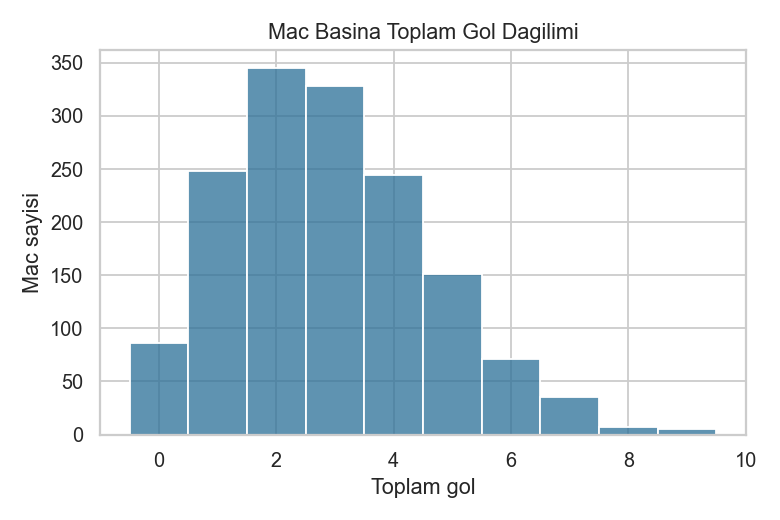
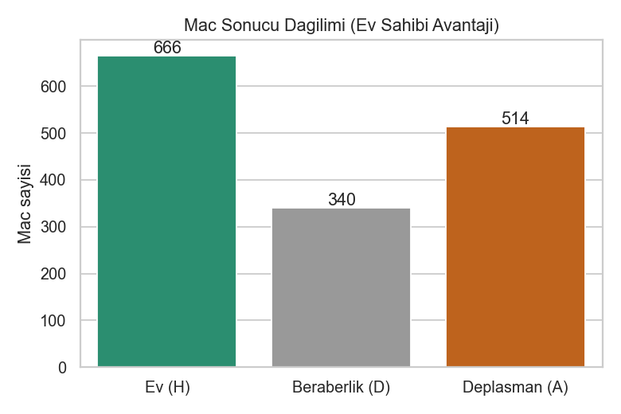
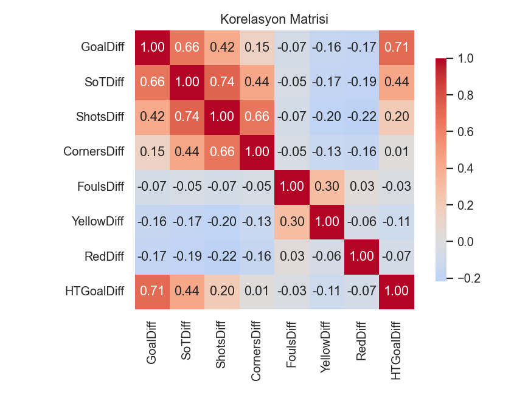
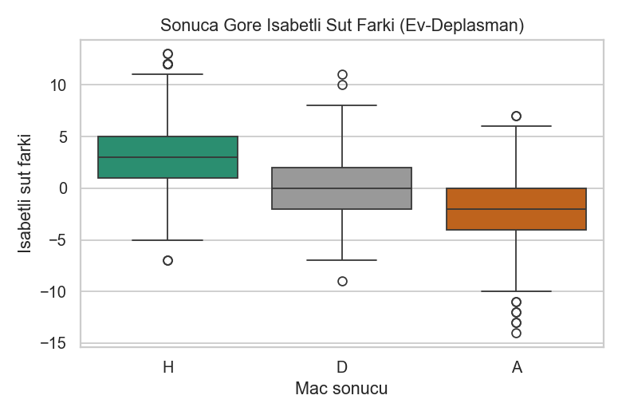
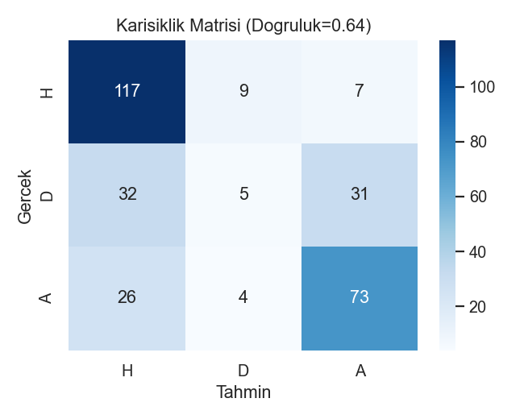

# Spor Analitiği — Açık Futbol Lig İstatistikleri

**Veri Bilimi Dönem Projesi — Kısa Rapor**

---

## 1. Problem Tanımı

Futbol, sonucu çok sayıda faktöre bağlı olan ve görece az gol içeren bir spordur; bu
nedenle maç içi istatistiklerin (şut, isabetli şut, korner, faul, kart, ilk yarı skoru)
sonucu ne ölçüde yansıttığı sık tartışılan bir konudur. Bazı istatistikler (örneğin toplam
şut) sezgisel olarak üstünlükle ilişkilendirilse de, bu ilişkinin yönü ve gücü çoğu zaman
varsayıldığı kadar net değildir. Bu proje, İngiltere Premier Lig'in dört sezonuna ait açık
maç verilerini kullanarak bu ilişkileri nicel olarak inceler.

Çalışma iki tamamlayıcı amaç güder:

1. **Betimsel analiz:** Ev sahibi avantajının ve maç içi istatistiklerin sonuçla ilişkisinin
   veriyle ortaya konması.
2. **Modelleme:** Maç içi istatistik farklarından maç sonucunu (Ev galibiyeti **H** /
   Beraberlik **D** / Deplasman galibiyeti **A**) tahmin eden basit ve yorumlanabilir bir
   sınıflandırma modelinin kurulması.

Yorumlanabilirlik bilinçli bir tercihtir: amaç yüksek doğruluklu bir tahmin motoru kurmak
değil, hangi oyun dinamiklerinin sonuçla ilişkili olduğunu anlaşılır biçimde göstermektir.
Bu çerçevede üç araştırma sorusu tanımlanmıştır:

- **S1.** Ev sahibi avantajı istatistiksel olarak gözlemlenebilir mi ve sezonlara göre değişir mi?
- **S2.** Hangi maç içi istatistik, gol farkıyla (maç üstünlüğü) en güçlü ilişkilidir?
- **S3.** İlk yarıyı önde kapatmak maç sonucunu ne ölçüde belirler?

## 2. Kullanılan Veri Seti ve Kaynağı

- **Veri seti:** İngiltere Premier Lig maç istatistikleri, **2020-21 → 2023-24** (4 sezon).
- **Kaynak:** datahub.io üzerindeki GitHub deposu `datasets/football-datasets`; veriler
  orijinal olarak `football-data.co.uk` sitesinden derlenmekte ve günlük güncellenmektedir.
- **Lisans:** Open Data Commons Public Domain Dedication and License (PDDL) v1.0 — veri,
  atıf zorunluluğu olmaksızın serbestçe kullanılabilir.
- **Boyut:** her sezon 380 maç olmak üzere 4 dosya, toplam **1520 maç**, 22 sütun.

Temel sütunlar: FTHG/FTAG (maç sonu gol), FTR (sonuç), HTHG/HTAG ve HTR (ilk yarı gol ve
sonucu), HS/AS (şut), HST/AST (isabetli şut), HC/AC (korner), HF/AF (faul), HY/AY (sarı
kart), HR/AR (kırmızı kart). Verinin genel görünümü aşağıda özetlenmiştir; maçların büyük
çoğunluğunda gol sayısı düşüktür ve dağılım sağa çarpıktır.

**Tablo 1. Seçili sütunlar için temel tanımlayıcı istatistikler (1520 maç).**

| İstatistik | Ev golü | Dep. golü | İsabetli şut (ev) | Korner (ev) | Sarı kart (ev) |
| ---------- | ------- | --------- | ----------------- | ----------- | -------------- |
| Ortalama   | 1.58    | 1.34      | 4.89              | 5.73        | 1.66           |
| Std. sapma | 1.37    | 1.25      | 2.67              | 3.10        | 1.27           |
| En yüksek  | 9       | 8         | 15                | 17          | 6              |

*Şekil 1. Maç başına toplam gol dağılımı (ortalama ≈ 2.91 gol/maç).*

## 3. Yöntem

**3.1 Veri Temizleme.** Dört sezon dosyası ayrı ayrı okunup her birine bir `Season` sütunu
eklendikten sonra tek tabloda birleştirildi. *Tip dönüşümü:* tarih sütunu tarih tipine,
gol/şut/korner/faul/kart sütunları tam sayıya çevrildi. *Aykırı değer:* ev sahibi toplam şut
(HS) sütunu hem IQR (24 maç) hem Z-score (|z|>3) yöntemiyle incelendi (en yüksek 36 şut);
bu maçlar gerçek ve hatasız olduğundan çıkarılmadı, yalnızca uzun kuyruklu dağılım not edildi.

*Eksik veri senaryosu:* Veri setinde gerçekte eksik değer ve yinelenen satır bulunmadı. Buna
rağmen, eksik veriyi ele alma yetkinliğini göstermek için verinin bir kopyasında iki sütuna
yapay olarak %6–10 eksik değer üretildi; bu eksikler önce tespit edilip görselleştirildi,
ardından üç yöntemle (ortalama, medyan, KNN) dolduruldu. Gerçek değerler saklandığından
yöntemler RMSE ile karşılaştırıldı: ilişkili sütunlardan yararlanan **KNN en düşük hatayı**
verdi (RMSE≈2.09; ortalama/medyan≈2.57). Asıl veri tam olduğundan ana analiz tam veriyle
sürdürüldü.

**3.2 Özellik Türetme.** Fark temelli sütunlar türetildi: isabetli şut farkı (SoTDiff),
toplam şut farkı, korner farkı, faul farkı, sarı/kırmızı kart farkları ve ilk yarı gol farkı
(HTGoalDiff). Fark değişkenleri iki takımın göreli üstünlüğünü tek bir sayıda topladığı için
daha yorumlanabilir bir temsil sağlar.

**3.3 EDA ve Modelleme.** Temel istatistikler çıkarıldı ve beş farklı görselleştirme türü
(histogram, çubuk grafik, kutu grafik, saçılım grafiği, ısı haritası) kullanıldı. Maç
sonucu (FTR) üç sınıflı hedef olarak alındı. Özellikler yalnızca maç içi istatistik
farklarıdır; maç sonu gol sayıları sonucu doğrudan tanımladığı için **bilinçli olarak
özellik kümesine dahil edilmedi**. Veri %80/%20 (eğitim/test) sınıf oranları korunarak
bölündü, standardize edildi ve **Lojistik Regresyon** eğitildi. Karşılaştırma için "en sık
sınıfı tahmin et" taban çizgisi kullanıldı.

*Neden makine öğrenmesi?* Araştırma sorularında değişkenler tek tek incelenir; makine
öğrenmesi ise tüm maç içi istatistikleri aynı anda değerlendirerek sonucun ne kadar
açıklanabildiğini nesnel ve test edilebilir biçimde (taban çizgisine karşı doğruluk) ölçer.
Bölme, ölçekleme, model ve değerlendirme adımlarının tamamı, bu bileşenleri hazır sunan
**scikit-learn** kütüphanesiyle gerçekleştirilmiştir.

## 4. Bulgular

### 4.1 (S1) Ev Sahibi Avantajı

Dört sezonun tamamında maçların **%43.8'i ev sahibi galibiyeti**, %33.8'i deplasman
galibiyeti, %22.4'ü beraberlikle sonuçlandı. Ev sahipleri maç başına ortalama 1.58 gol
atarken deplasman takımları 1.34 gol attı. Bu üstünlüğün rastlantı olmadığını doğrulamak
için kesin sonuçlu (beraberlik olmayan) 1180 maç üzerinde bir **binom testi** uygulandı
(H₀: ev sahibinin kazanma olasılığı = 0.5). Ev sahibi bu maçların %56.4'ünü kazanmıştır ve
fark istatistiksel olarak anlamlıdır (p≈1.1×10⁻⁵ ≪ 0.05).

*Şekil 2. Tüm sezonlar için maç sonucu dağılımı.*

Ancak sezon kırılımı önemli bir nüans ortaya koyar: **2020-21 sezonunda ev sahibi
galibiyeti (%37.9), deplasman galibiyetinin (%40.3) altında kalmıştır.** Bu, ev avantajının
kaybolduğu tek sezondur ve maçların pandemi nedeniyle büyük ölçüde **seyircisiz** oynandığı
döneme denk gelir. Sonraki seyircili sezonlarda ev avantajı yeniden belirginleşmiştir.

**Tablo 2. Sezonlara göre sonuç dağılımı ve maç başına gol.**

| Sezon   | Maç  | Ev gal. % | Berabere % | Dep. gal. % | Gol/maç |
| ------- | ---- | --------- | ---------- | ----------- | ------- |
| 2020-21 | 380  | 37.9      | 21.8       | 40.3        | 2.69    |
| 2021-22 | 380  | 42.9      | 23.2       | 33.9        | 2.82    |
| 2022-23 | 380  | 48.4      | 22.9       | 28.7        | 2.85    |
| 2023-24 | 380  | 46.1      | 21.6       | 32.4        | 3.28    |
| **Genel** | **1520** | **43.8** | **22.4** | **33.8** | **2.91** |

### 4.2 (S2) Belirleyici İstatistik

Gol farkı (maç üstünlüğü) ile maç içi istatistik farkları arasındaki korelasyonlar
incelendiğinde, ilk yarı gol farkından (r≈0.71) sonra en güçlü ilişki **isabetli şut
farkındadır (r≈0.66)**. Toplam şut farkının ilişkisi daha zayıftır (r≈0.42); yani şutun
*kalitesi* (isabet), *miktarından* daha belirleyicidir. Kartların ilişkisi ise **negatiftir**
(sarı r≈−0.16, kırmızı r≈−0.17): kart, üstünlüğün nedeni değil, çoğunlukla geride/baskı
altında olmanın bir sonucudur — korelasyonun nedensellik olmadığının somut bir örneği.

*Şekil 3. Türetilmiş değişkenler arası korelasyon matrisi.*

*Şekil 4. Maç sonucuna göre isabetli şut farkının (ev − deplasman) dağılımı.*

### 4.3 (S3) İlk Yarı Üstünlüğü

İlk yarı sonucu (HTR) ile maç sonu sonucu (FTR) arasındaki koşullu olasılıklar, ilk yarı
üstünlüğünün güçlü bir belirleyici olduğunu gösterir. **İlk yarıyı önde kapatan ev sahibi
takımlar maçların %78.2'sini**, ilk yarıyı önde kapatan deplasman takımları ise %72.7'sini
kazanmıştır.

**Tablo 3. İlk yarı sonucuna göre maç sonu olasılıkları (satır yüzdesi, %).**

| İlk yarı \ Maç sonu | Ev galibiyeti (H) | Beraberlik (D) | Dep. galibiyeti (A) |
| ------------------- | ----------------- | -------------- | ------------------- |
| Ev önde (H)         | 78.2              | 14.8           | 7.0                 |
| Berabere (D)        | 36.5              | 32.8           | 30.7                |
| Dep. önde (A)       | 10.9              | 16.4           | 72.7                |

### 4.4 Model Sonuçları

Lojistik regresyon modeli test kümesinde **%64.1 doğruluk** elde etti ve taban çizgisinin
(%43.8) belirgin biçimde üzerine çıktı. Sınıf bazlı metrikler modelin ev (H) ve deplasman
(A) galibiyetlerini iyi ayırdığını, ancak **beraberlikleri (D) neredeyse hiç
yakalayamadığını** gösterir (beraberlik duyarlılığı yalnızca 0.07).

**Tablo 4. Test kümesi (304 maç) sınıf bazlı performans metrikleri.**

| Sınıf               | Kesinlik | Duyarlılık | F1   | Örnek sayısı |
| ------------------- | -------- | ---------- | ---- | ------------ |
| Ev galibiyeti (H)   | 0.67     | 0.88       | 0.76 | 133          |
| Beraberlik (D)      | 0.28     | 0.07       | 0.12 | 68           |
| Dep. galibiyeti (A) | 0.66     | 0.71       | 0.68 | 103          |
| **Genel doğruluk**  | —        | —          | **0.64** | **304**  |

*Şekil 5. Test kümesi karışıklık matrisi (Doğruluk ≈ %64).*

Modelin standardize edilmiş katsayıları bulgularla uyumludur: ev galibiyeti olasılığını en
çok artıran özellikler ilk yarı gol farkı (katsayı ≈ +1.13) ve isabetli şut farkıdır
(≈ +0.92). Korner farkının katsayısı ev galibiyeti için hafifçe negatiftir (≈ −0.26); bu da
S2'deki "çok korner = üstünlük değildir" gözlemini destekler. Böylece model, korelasyon
analiziyle aynı hikâyeyi bağımsız bir yöntemle teyit eder.

## 5. Sınırlamalar

- **Açıklama vs. tahmin:** Özellikler maç içi istatistiklerdir; model maç **öncesi** tahmin
  yapmaz, sonucu *açıklar*. Gerçek bir öngörü sistemi maç öncesi değişkenler (form, kadro,
  sakatlık, bahis oranları) gerektirir.
- **Kapsam ve genellenebilirlik:** Yalnızca tek lig ve dört sezon kullanıldığından bulgular
  başka liglere doğrudan genellenemeyebilir.
- **Zaman boyutunun göz ardı edilmesi:** Model her maçı bağımsız kabul eder; form/momentum
  gibi zamana bağlı etkiler dahil edilmemiştir.
- **Beraberlik sınıfı:** Beraberlikler doğası gereği modellenmesi zordur; sınıf dengesizliği
  performansı düşürür.
- **Model kapsamı:** Proje süresi gereği hiperparametre optimizasyonu yapılmamış, tek ve
  savunulabilir bir model tercih edilmiştir.

## 6. Öğrenilenler

- **Temizlik analizden önce gelir:** Tip dönüşümü, eksik ve aykırı değer kontrolü sonuçların
  güvenilirliğini doğrudan belirler; aykırı değerleri körü körüne silmek yerine bağlamını
  değerlendirmek gerekir.
- **Korelasyon nedensellik değildir:** Kart–sonuç ilişkisinin negatif çıkması bunun net bir
  örneğidir.
- **Bağlam istatistikleri değiştirir:** Seyircisiz 2020-21 sezonunda ev avantajının
  kaybolması, sayıların ardındaki gerçek dünya koşullarını sorgulamanın önemini gösterir.
- **Basit model de değerlidir:** Yorumlanabilir bir model bile temayla ilgili anlamlı,
  savunulabilir içgörüler üretebilir; karmaşık model her zaman gerekli değildir.
- **Tek metrik yanıltır:** Bir sınıfın düşük performansı, genel doğruluk kadar sınıf bazlı
  metriklerin ve karışıklık matrisinin de incelenmesi gerektiğini hatırlatır.
- **Tekrarlanabilirlik:** Rastgelelik tohumunun sabitlenmesi ve verinin depoda tutulması,
  analizin birebir yeniden üretilebilmesini sağlar.

Bütün olarak bakıldığında, dar kapsamlı ama derinleştirilmiş bu çalışma, açık bir veri
setiyle anlamlı sorular sorup bunları hem betimsel analiz hem de basit modelleme yoluyla
tutarlı biçimde yanıtlamanın mümkün olduğunu göstermektedir.

---

*Bu rapor, depodaki `notebook/spor_analitigi.ipynb` dosyasındaki analizlerin özetidir.
Tüm sayısal değerler ve grafikler aynı notebook çalıştırılarak yeniden üretilebilir.*
